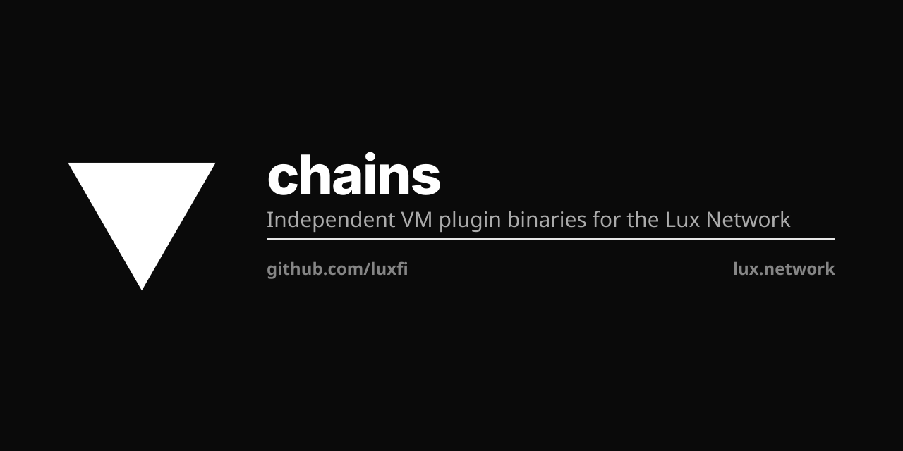

<p align="center"></p>

# Lux Chains

Independent VM plugin binaries for the Lux Network.

Each directory builds to a standalone binary that the Lux node loads as a plugin via `--plugin-dir`.

## Build

```bash
make            # build all VMs
make evm        # build one VM
make test       # test all
```

## Install

```bash
lpm install evm
lpm install dexvm
```

Or copy binaries to `~/.lux/plugins/<vmid>`.

## VMs

`make`'s target list is named in the Makefile, and every name in it is a
directory here that ships a plugin entrypoint (`<vm>/cmd/plugin`, or `evm/main.go`).
`dexvm/` is the exception in the table below: it is a library the EVM plugin
embeds — it has no entrypoint of its own, so `make` builds no `dexvm` binary.
The other directories here (`fee/`, `ownership/`, `internal/`, `cmd/`) are
libraries and a tool, and are not VMs.

**Live** means the VM has a chain registered on Lux mainnet 96369
(`platform.getBlockchains`).

| VM | Chain | Live on 96369 | Purpose |
|----|-------|---------------|---------|
| evm | C-Chain | ✅ | EVM smart contracts |
| dexvm | D-Chain | ✅ | Decentralized exchange |
| aivm | A-Chain | ✅ | AI/ML inference |
| bridgevm | B-Chain | ✅ | Cross-chain bridge — also owns *all* cross-chain messaging / relay / teleport (LP-6000); there is no separate `teleportvm` |
| graphvm | G-Chain | ✅ | GraphQL data layer |
| keyvm | K-Chain | ✅ | Key management |
| quantumvm | Q-Chain | ✅ | Post-quantum consensus signing (Pulsar) |
| zkvm | Z-Chain | ✅ | Groth16 over BLS12-381 (rolls N × ML-DSA-65 sigs into 192-byte proof) |
| identityvm | I-Chain | ❌ built, not deployed | Decentralized identity |
| oraclevm | O-Chain | ❌ built, not deployed | Oracle/off-chain data |
| relayvm | R-Chain | ❌ built, not deployed | Cross-chain relay |
| mpcvm | M-Chain | ❌ built, not deployed | MPC ceremonies (CGGMP21, FROST, Pulsar-general) — bridge custody for external wallets (LP-7100) |
| fhevm | F-Chain | ❌ built, not deployed | Confidential compute (LP-8200): ciphertext handles, access permits, threshold decryption. Records the public coordinates of encrypted values and holds none of the encrypted part — no ciphertext body, no FHE key, no share. Wraps the FHE runtime at `mpcvm/fhe/` |
| schain | S-Chain | ❌ built, not deployed | S3-style object storage (on-chain metadata / off-chain blob). Declares its own `VMID = ids.ID{'s','c','h','a','i','n'}` in `schain/factory.go` and is **not** in the canonical `luxfi/constants` VM-ID registry |

`P-Chain` (platformvm) and `X-Chain` (xvm) are in-process core VMs registered by
`luxfi/node`, not plugins built here. Together with the eight ✅ rows above they
are the ten chains live on 96369.

### Not in this repo

| Name | Status |
|------|--------|
| `teleportvm` / T-Chain | **Removed.** LP-134 dissolves T-Chain with zero remainder: threshold signing → M-Chain, FHE → F-Chain, cross-chain messaging/teleport → B-Chain (`bridgevm`). LP-5013 and LP-7330 are deprecated by LP-134; see LP-7050 for the migration map. No `teleportvm` VM ID exists in `luxfi/constants`. |
| `servicenodevm` | **Never existed.** The service-node registry was never built under this name; the S-Chain directory here is `schain/` and is object storage, not a registry. |

### Plugin filenames

luxd resolves a `CreateChainTx`'s vmID to an implementation by looking for a file
of that name in `--plugin-dir`, so a plugin installed under any other name is
invisible and its chain silently never starts. The filename is the CB58 of the
vmID — `n6sSsSfbpQBrU9sY4R29U6z8VrmnTo2CntW6da4rRS7qmnGdv` for `fhevm`,
`qCURact1n41FcoNBch8iMVBwc9AWie48D118ZNJ5tBdWrvryS` for `mpcvm`. Each VM pins its
own in a test, because a vmID cannot change once a chain has been created with it.
