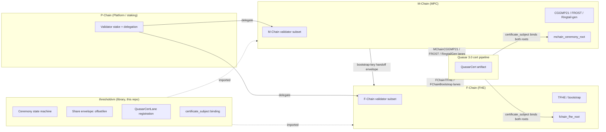

# ThresholdVM Design

> Status: Final for Quasar 3.0 activation (2025-12-25)
> Supersedes the T-Chain monolith (LP-5013), per LP-134

## 1. Position in the topology



The substrate has **zero** runtime presence. It compiles into both
chains' binaries.

## 2. Why M and F are separate operational chains

| Dimension | M-Chain | F-Chain |
|---|---|---|
| Workload | sign-oriented (latency-critical, sub-second) | compute-oriented (throughput-critical, multi-second) |
| Block cadence | ~500 ms | ~2 s typical |
| Validator profile | bandwidth + low latency | GPU + memory bandwidth (TFHE bootstrap is GPU-bound) |
| Failure cost | a missed signature delays a bridge tx | a slow FHE compute delays a confidential contract |
| Stake profile | wide / many small validators (Bitcoin-like) | narrower / GPU operators self-select |
| Ceremony root | `mchain_ceremony_root` | `fchain_fhe_root` |
| QuasarMode | Nebula (DAG of partials) | Nebula (computation graph) |

Sharing one validator set would force the GPU operators on F-Chain to
also keep up with M-Chain's 500 ms cadence (or vice versa). Keeping
the chains separate lets each scale on its own validator subset, both
permissionlessly carved out of P-Chain stake.

## 3. The shared state machine

```
StateRegistered  -- all participants for ceremony C have committed stake
       |
       v
StateRound1      -- each participant broadcasts commitments (per-protocol payload)
       |
       v
StateRound2      -- each participant distributes shares (per-protocol payload)
       |
       v
StateFinalized   -- aggregator emits CertLane artifact, ceremony root advances
```

Round semantics are protocol-specific (FROST is 2-round, CGGMP21
pre-sign + sign, TFHE keygen is multi-round) but the **envelope** is
identical: per-round payload is carried by `(offset, len)` indirection
into a single artifact buffer.

The state machine is implemented in `types/ceremony.go` as a simple
explicit-transition function. No goroutines, no timers in the
substrate — each chain's runtime drives transitions on block ticks.

## 4. Share envelope (per-protocol payload via offset/len)

```go
// types/share.go
type Share struct {
    CeremonyID    [32]byte // hash(ceremony_descriptor)
    ParticipantID uint32   // index into ParticipantSet
    Round         uint8    // 1 or 2 for FROST/CGGMP21; up to 4 for Ringtail/TFHE
    Lane          CertLane // dispatches per-protocol verifier
    PayloadOffset uint32   // offset into ceremony's payload arena
    PayloadLen    uint32   // length of this share's payload
    Signature     [64]byte // BLS or ML-DSA signature over (CeremonyID, Round, payload)
}
```

This matches the `(artifact_offset, artifact_len)` indirection used by
`QuasarCertIngress` (LP-132 §drain_cert_lane). New protocols append a
new `CertLane` enum value and a new verifier; **the envelope never
changes**.

## 5. QuasarCertLane registration

```go
// cert/lane.go
type LaneVerifier interface {
    Lane() CertLane
    Verify(subject [32]byte, share Share, payload []byte) error
}

type LaneRegistry interface {
    Register(LaneVerifier) error
    Verifier(CertLane) (LaneVerifier, error)
}
```

- M-Chain's runtime calls `Register(MChainCGGMP21Verifier{})`,
  `Register(MChainFROSTVerifier{})`,
  `Register(MChainRingtailGenVerifier{})` at boot.
- F-Chain's runtime calls `Register(FChainTFHEVerifier{})`,
  `Register(FChainBootstrapVerifier{})` at boot.
- Each chain's registry instance is private to that chain's process.
  The substrate provides the type, not a global.

## 6. Certificate-subject binding

LP-134 extends `QuasarRoundDescriptor`:

```cpp
uint8_t mchain_ceremony_root[32];
uint8_t fchain_fhe_root[32];
// ... and seven other roots ...
uint8_t certificate_subject[32];  // binds all of them
```

`certificate_subject = H(parent_block || state_root || exec_root || pchain_validator_root || qchain_ceremony_root || zchain_vk_root || achain_attestation_root || bchain_bridge_root || mchain_ceremony_root || fchain_fhe_root)`

The substrate's `cert/subject.go` exposes `BindSubject(...)` and
`Verify(subject, lane, share)`. **Both** `mchain_ceremony_root` and
`fchain_fhe_root` are inputs, regardless of which chain emitted the
ceremony — this is the structural property that makes
cross-chain-replay impossible (a cert artifact for an M-Chain
ceremony cannot be replayed against F-Chain because the F-Chain root
on the destination round disagrees by construction).

## 7. Permissionless participation

The substrate enforces, via `types/participant.go`:

1. `ParticipantSet` is derived **deterministically** from
   `pchain_validator_root` + chain-specific delegation. No allowlist.
2. Selection is done by VRF-weighted sampling on stake delegated to
   M-Chain or F-Chain respectively. Same security analysis as Lux's
   existing P-Chain selection.
3. Threshold parameters (`t-of-n`) are policy controlled by the
   chain's governance, but minimum `t >= n/2 + 1` is enforced at the
   library level.
4. Resharing (LP-077 LSS) is supported via the same envelope —
   resharing is just a ceremony whose output is a new key share for a
   new participant set.

## 8. Cross-chain handoff (M → F)

Most ceremonies live entirely on one chain. The exception is **TFHE
bootstrap-key generation**, which uses MPC (M-Chain) to generate a
key the FHE engine (F-Chain) consumes:

```
1. M-Chain runs FROST DKG over the TFHE secret-key polynomial.
2. On finalize, M-Chain emits a CertLane artifact with lane =
   MChainFROST. The artifact's payload encodes the TFHE evaluation
   key + bootstrap material.
3. F-Chain ingests the artifact at its next round via lane =
   FChainBootstrap (which wraps the upstream MChainFROST cert).
4. fchain_fhe_root advances to commit the new key.
5. Quasar 3.0's certificate_subject in the round binds both
   mchain_ceremony_root (with the FROST output) and fchain_fhe_root
   (with the new bootstrap key) — atomic from the network's view.
```

The handoff envelope is just a `Share` with `Lane=FChainBootstrap`
that wraps the upstream `Lane=MChainFROST` artifact via offset/len
into the same buffer. No new envelope type.

## 9. Migration adapters (T-Chain → M/F)

The substrate hosts:

- `cert/lane.go`: legacy `TChainSign` and `TChainFHE` lane numbers
  are accepted during the one-epoch grace window after activation
  (2025-12-25 → next epoch). The verifier dispatches them to
  `MChain*` and `FChain*` respectively.
- After grace, the dispatch table drops the legacy entries. The
  substrate has no grace logic of its own — it just exposes
  `RegisterLegacyAlias(legacyLane, modernLane)` which the chain's
  runtime wires up at boot for one epoch.

## 10. Type-level orthogonality

The split is enforced by Go interface, not convention:

- `runtime.MChainAdapter` exposes only MPC ceremony hooks (`OnDKG`,
  `OnSign`, `OnReshare`).
- `runtime.FChainAdapter` exposes only FHE compute hooks (`OnKeygen`,
  `OnEval`, `OnBootstrap`).
- The substrate's lane registry refuses to accept a verifier whose
  `Lane()` value is in the M-Chain range (5–7) from the F-Chain
  registry, and vice versa. A misconfigured chain fails at boot, not
  at runtime.

This makes "M-Chain accidentally hosts FHE compute" a compile-time
or boot-time failure, not a silent semantic bug.

## 11. References

Per LP-134 (Lux Chain Topology), the legacy T-Chain monolith is split into
two operational chains served by this same `thresholdvm` substrate:

- `thresholdvm` in **MPC mode → M-Chain** (CGGMP21, FROST, Ringtail-gen).
- `thresholdvm` in **FHE mode → F-Chain** (TFHE keygen, encrypted EVM).

The standalone `teleportvm` (LP-6332) is unrelated and retains its own
"T-Chain" naming for the cross-chain teleport message bus.

| LP | Topic |
|---|---|
| LP-019 | Threshold MPC for Bridge Signing (M-Chain protocols) |
| LP-013 | FHE on GPU (F-Chain compute) |
| LP-076 | Universal Threshold Cryptography Framework |
| LP-077 | Linear Secret Sharing (resharing) |
| LP-132 | QuasarGPU Execution Adapter |
| LP-134 | Lux Chain Topology — defines the M/F-Chain split |
| LP-020 | Quasar Consensus 3.0 |
| LP-6332 | teleportvm cross-chain message bus (separate "T-Chain") |
| LP-5013 | T-Chain MPC Custody (deprecated, superseded by LP-134) |
